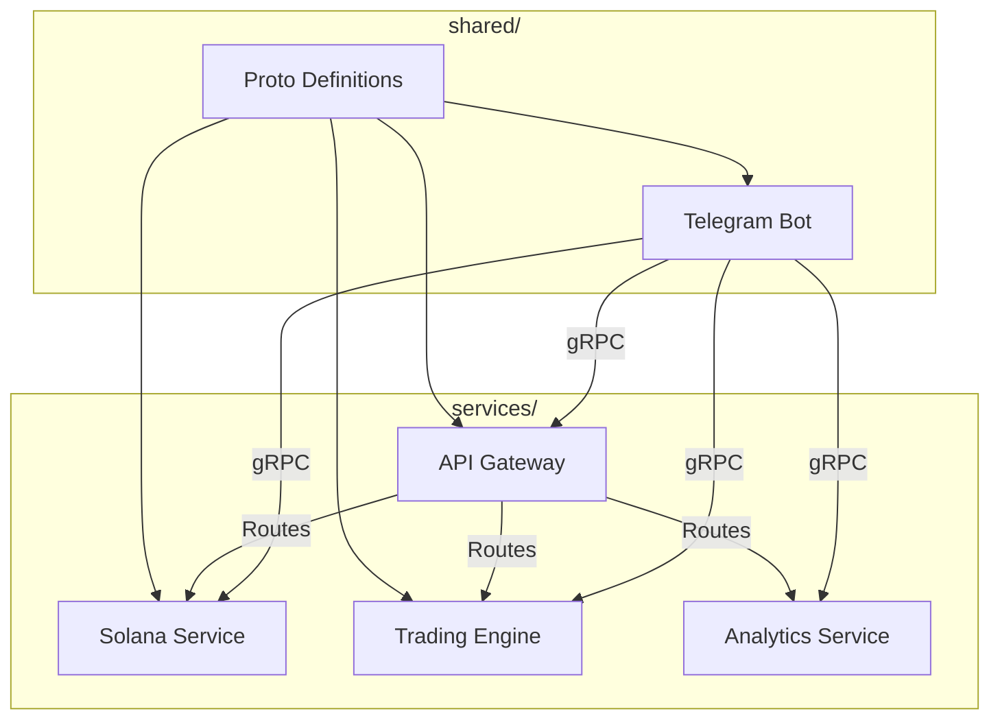

# 🧠 Solanalysis

**Solanalysis** is a modular, Rust-based backend system for interacting with wallets, trading engines, and blockchain analytics via a lean and user-friendly Telegram interface.

Originally designed as a wallet tracking tool for **Solana** and **Eclipse** networks, it’s evolving into a broader platform with capabilities including trading, lending, token issuance, NFT deployment, and more — all through a composable microservice architecture.

Each service exposes a focused gRPC interface, allowing the Telegram bot to remain lightweight, decoupled, and responsive while integrating new functionality incrementally.

---

## ⚙️ Architecture

---

## ✨ Highlights

- **Rust-native**: Every component is written in Rust for performance, safety, and maintainability.
- **Composable microservices**: New features (e.g. trading, flash loans, NFT deployment) are added via independent gRPC services.
- **Decoupled UX**: Telegram bot is stateless and UI-driven, all logic lives in backend services.
- **Lean interface**: One Telegram bot, infinite on-chain capabilities.

---

## 🚀 Getting Started

# Clone the repo
git clone https://github.com/your-org/solanalysis.git
cd solanalysis

# Build all services
cargo build --workspace

---

⚠️ This project is under active development. Features will be added incrementally with an emphasis on stability, performance, and extensibility.

Let me know if you'd like to also include a visual tree of the directory structure or describe how services communicate in more detail.
